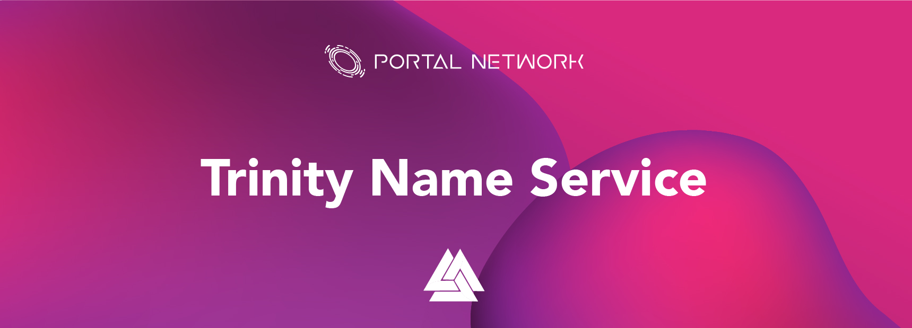

> 📖🔍 Documents of the Trinity Name Service.

# Overview

## 💡 What is Trinity?
Trinity is a state channel that is an offchain scaling scheme for NEO, and it applicable to NEP-5 standard tokens and NEO UTXO assets. It is a NEO version lighting network.
State channels can be seen as exclusive trade channels to participants, complicated processing data will be offchain, only the final balance will be settled on NEO mainnet.

## 📚 Documents

#### Table of Contents
- [Introduction](./docs/INTRODUCTION.md)
- [Tutorial](./docs/TUTORIAL.md)
- [How To Start A Channel ](./docs/Trinity_Tutorial.md)

## 📝 Trinity in Web3.0
Trinity plays an connecting and entry layer in Web3.0 services. It connects with Trinity wallet, state channels and decentralized resources.

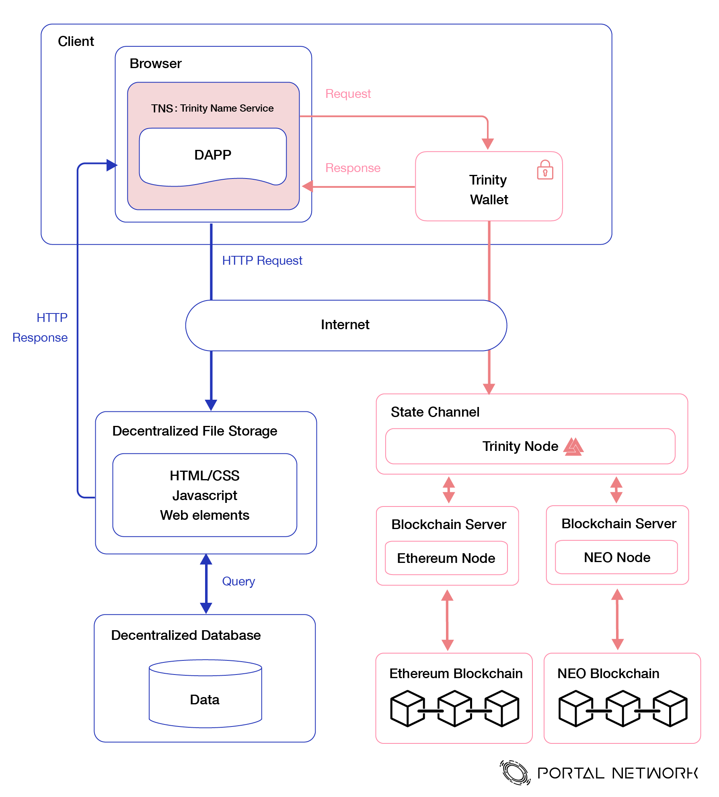

## 🗂️ Trinity Tech Stack
The Web3 technology consists of different technical layers, with each layer in charge of solving different tasks. The technical layer is built from top to bottom along the y-axis, implying the bottom ones are built upon the upper ones. 
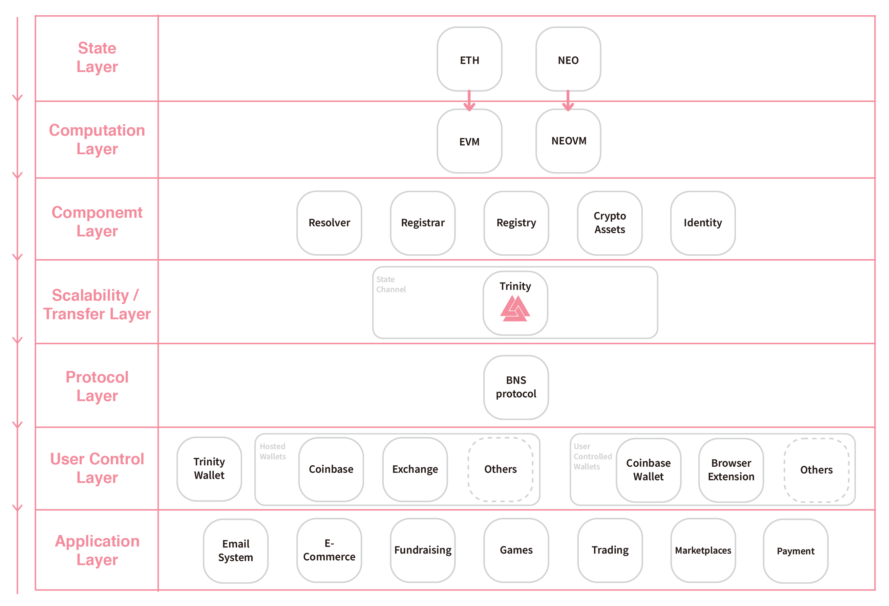

### State Layer
The state layer is the fundamental internet system which stores the state information for any users. Ethereum and NEO have robust and reliable nodes to maintain the global decentralized network and record each state data changes of any users' account.
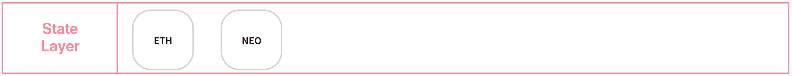

### Computation Layer
The computation layer provides the programming running environment, to let different logics and rules can be processed correctly in the network. Ethereum Virtual Machine(EVM) and NEO-VM(NEO Virtual Machine) compiles the smart contracts to instruct machines to execute the logic as writting in smart contracts.
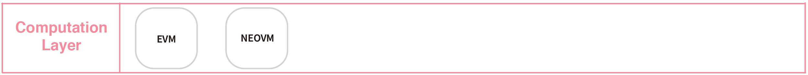

### Component Layer
There are many smart contracts patterns and standards have come out from the blockchain developers and communities. The component layer shows that combining the state layer and computation layer we can built and design various kinds of digital value natively existing in the decentralized network.
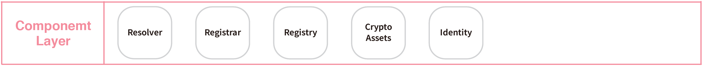

### Scalability / Transfer Layer
It can be distinguished of how to achieve increasing the transactions processing capacity into two perspectives, one is on-chain, and the other one is off-chain. The state channel is one of the offline scaling solutions, the main process is to first open a channel between two addresses, to let both parties can send transactions frequently, and after finishing the deal, the result of transactions will be sent to the main network.
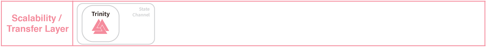

### Protocol Layer
Trinity Name Service contains three main logic components, which are the registrar, registry, and resolver components. BNS protocol provides the standard interfaces and modularizes each of the responsibility for each component. Registrar component is in charge of dealing with the process of acquiring ownership for a specific Trinity domain. Registry componenet stores the ownership for the domain, sub-domain, and so forth. Resolver component establishes setting and getting the mapping resources for the domain.
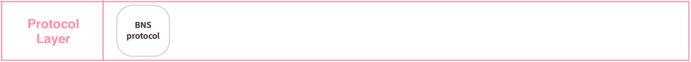

### User Control Layer
The user control layer plays a crucial role in blockchain technology adoption. If there is no GUI wallet to manage private keys and operations on-chain for average users, the users have to operate the related transactions and manage all kinds of stuff with command line tools, therefore, the better user experience in this layer, the more users will participate in the ecosystem.
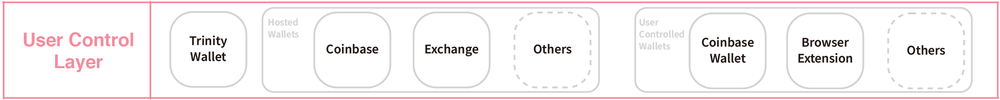
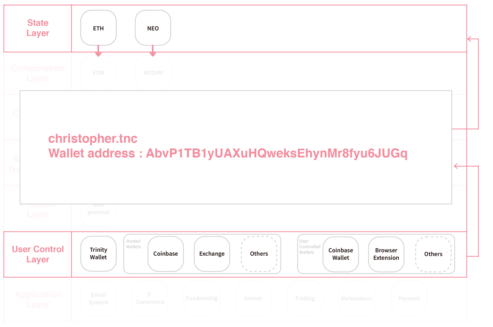

### Application Layer
The application layer is full of various services and is built upon on the user control layer, therefore, Trinity Name Service can reduce the complexity and enhance the user experience in on-chain operations. Such as. Trinity domains play an important role whenever users or developers want to send/receive tokens, sign and send transactions to contract and view the decentralized content resources and many more.
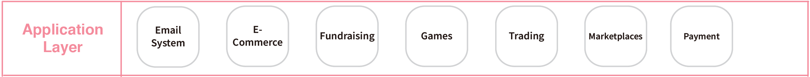

# Introduction

## Install Trinity

#### Clone source code
```
git clone https://github.com/trinity-project/trinity.git
cd trinity
```

#### Using python 3.6+ 
```
// find path for python 3.6+ path
which python3

// using python for the virtual environment
virtualenv -p /Library/Frameworks/Python.framework/Versions/3.6/bin/python3 venv
```

#### Install dependency
```
pip install -r requirements
```

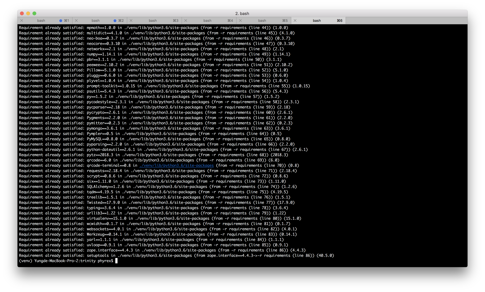

#### Setting config
```
vi gateway/config.py
```

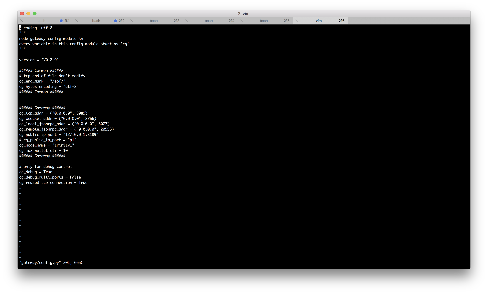

#### Start Trinity gateway

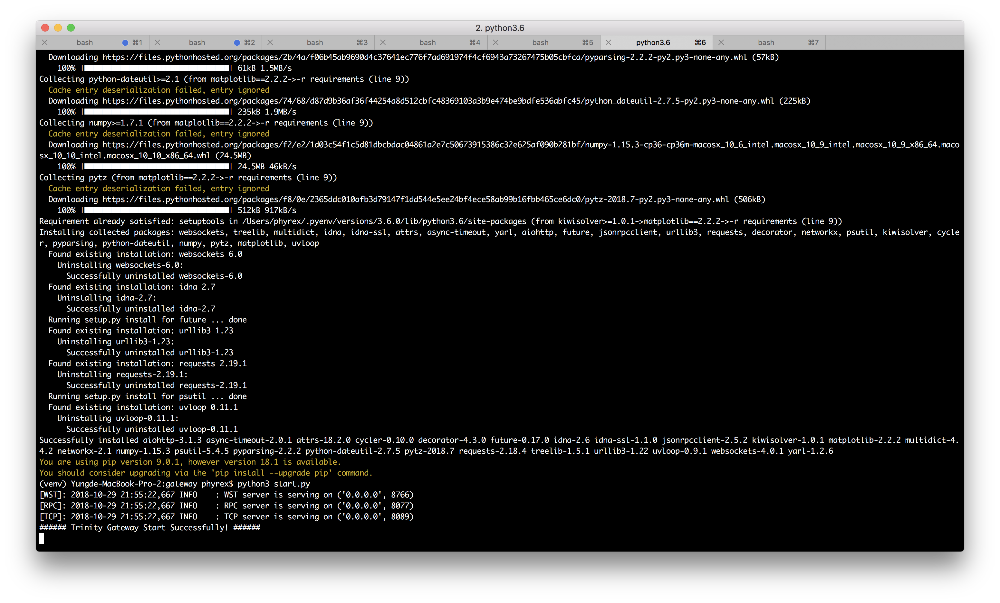

#### Create wallet
```
python3 prompt.py
```

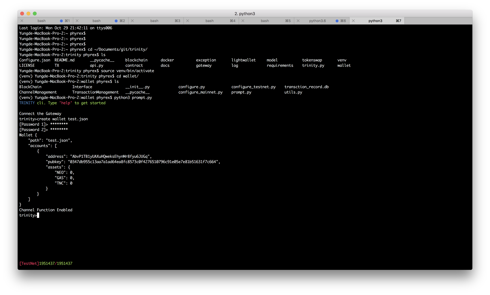

#### Trinity commands
```
channel show uri
channel depoist_limit
```

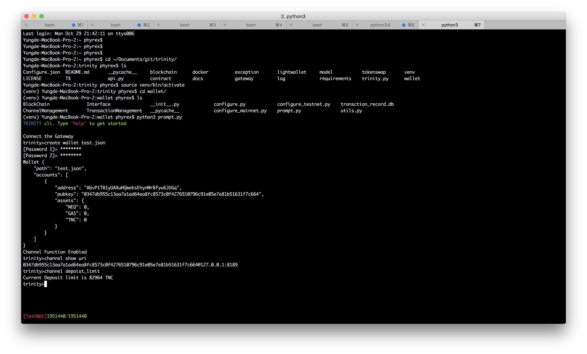

## 🔗 Links
- [Official Website](https://trinity.tech/)

## 📣 Contributing
See [CONTRIBUTING.md](./CONTRIBUTING.md) for how to help out.

## 🗒 Licence
See [LICENSE](./LICENSE) for details.
